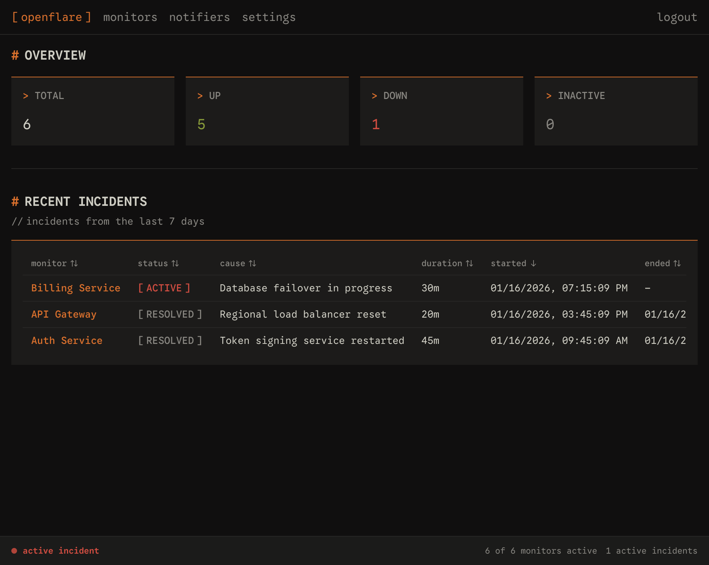
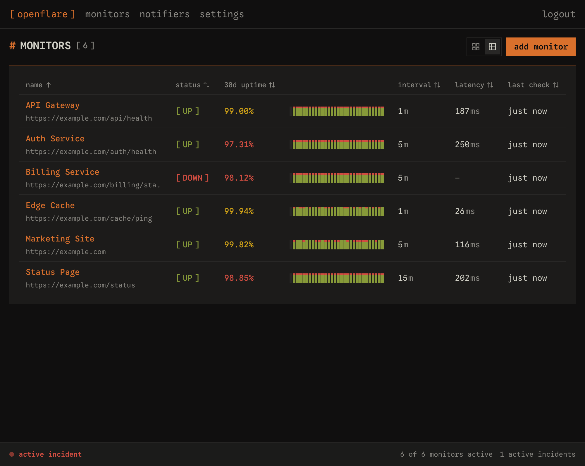
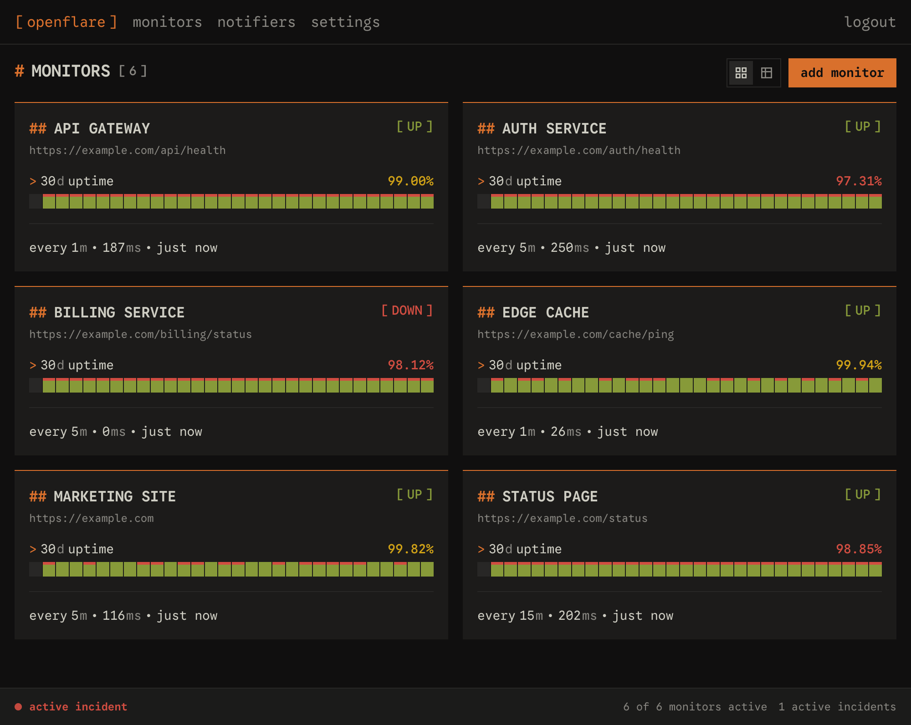
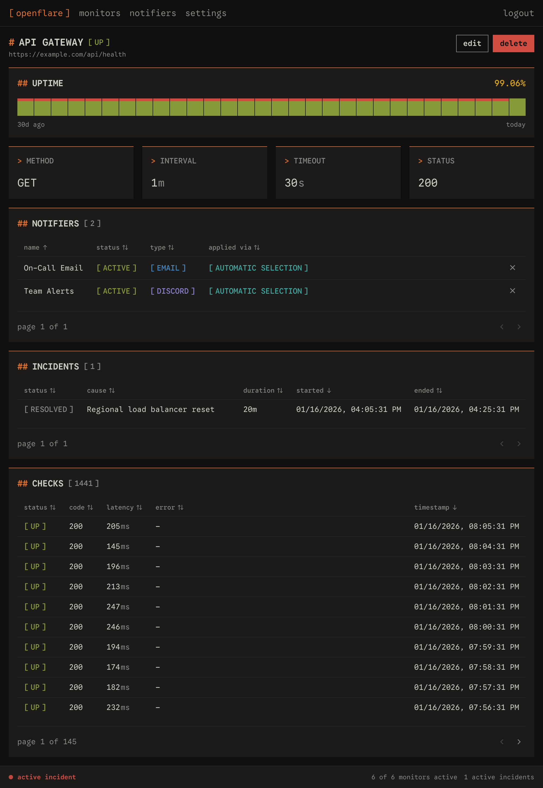
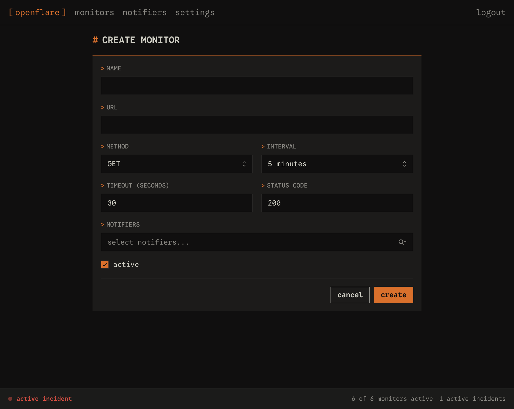
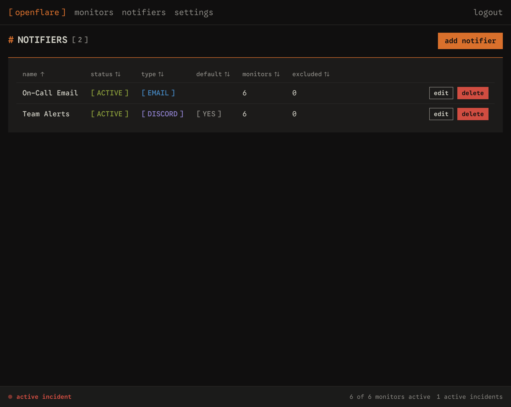
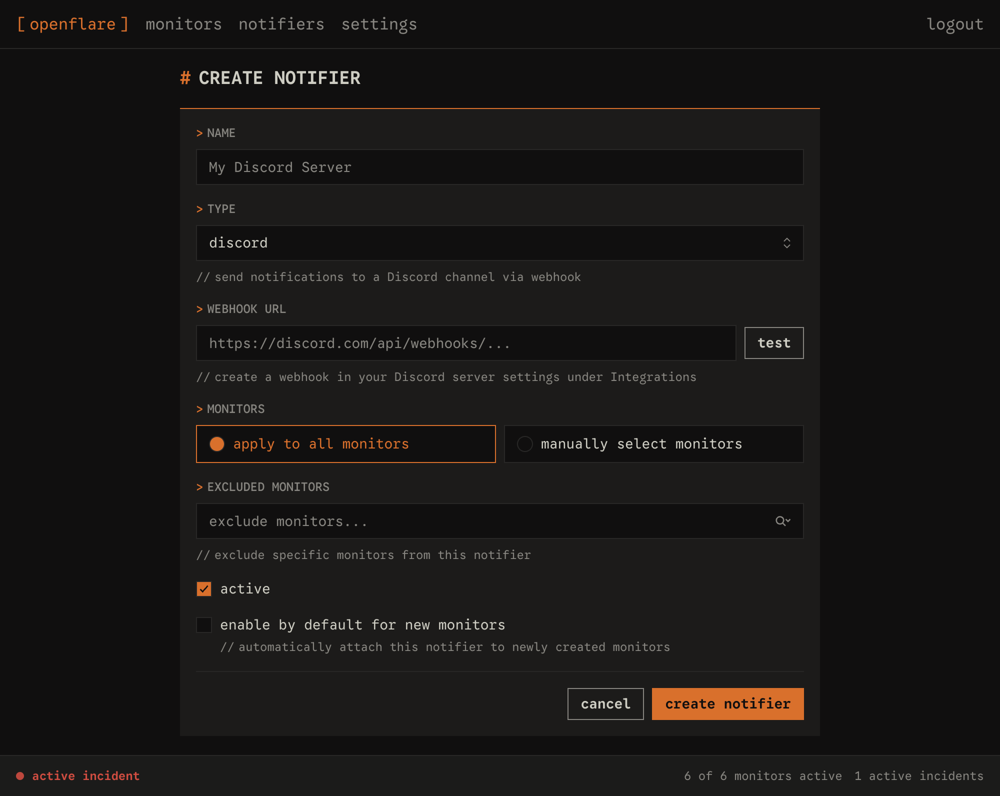

# OpenFlare

A self-hostable uptime monitoring application.

I built OpenFlare because I wanted a basic uptime tool that was easy to self-host. I took inspiration from [Uptime Kuma](https://github.com/louislam/uptime-kuma) and [OpenStatus](https://www.openstatus.dev/) while keeping OpenFlare as minimal as possible. This project also served as an experiment in agentic programming; it was written almost entirely by Claude Opus 4.5, GPT-5.2, and GPT-5.2 Codex using [OpenCode](https://opencode.ai/) with the [Laravel Boost MCP](https://laravel.com/ai/boost). Laravel's full-stack capabilities and first-party MCP support made it a natural fit for exploring AI-native development workflows.

## Features

- Monitor REST API uptime and response times
- Automatic incident tracking and resolution
- Discord and email notifications
- Real-time dashboard via WebSockets
- 30-day uptime history charts
- Two-factor authentication

## Tech Stack

- Laravel 12, PHP 8.4
- React 19, Inertia.js v2, TypeScript
- Tailwind CSS v4
- SQLite or PostgreSQL
- Laravel Reverb (WebSockets)

## Development

[Install PHP and the Laravel installer](https://laravel.com/docs/12.x/installation).

```bash
composer run setup
composer run dev
```

## Environment Variables

Required

| Variable            | Description      | Notes                                       |
| ------------------- | ---------------- | ------------------------------------------- |
| `APP_KEY`           | Encryption key   | Generate: `php artisan key:generate --show` |
| `APP_URL`           | Public URL       | Default: `http://localhost:8000`            |
| `REVERB_APP_KEY`    | WebSocket key    | Generate: `openssl rand -hex 16`            |
| `REVERB_APP_SECRET` | WebSocket secret | Generate: `openssl rand -hex 32`            |

Email notifications (optional)

| Variable            | Description    | Notes                                     |
| ------------------- | -------------- | ----------------------------------------- |
| `MAIL_MAILER`       | Mail driver    | `log` default, or `resend` for production |
| `MAIL_FROM_ADDRESS` | Sender address |                                           |
| `RESEND_API_KEY`    | Resend API key | Required when `MAIL_MAILER=resend`        |

Database (optional)

| Variable        | Description             | Notes                                                                |
| --------------- | ----------------------- | -------------------------------------------------------------------- |
| `DB_CONNECTION` | Database driver         | `sqlite` default, `pgsql` for Postgres                               |
| `DB_DATABASE`   | SQLite path             | Local `database/database.sqlite`, production `/data/database.sqlite` |
| `DATABASE_URL`  | Postgres connection URL | Alternative to `DB_CONNECTION`/`DB_DATABASE`                         |

See [.env.example](.env.example) for full list and deployment notes.

## Screenshots



---



---



---



---



---



---


